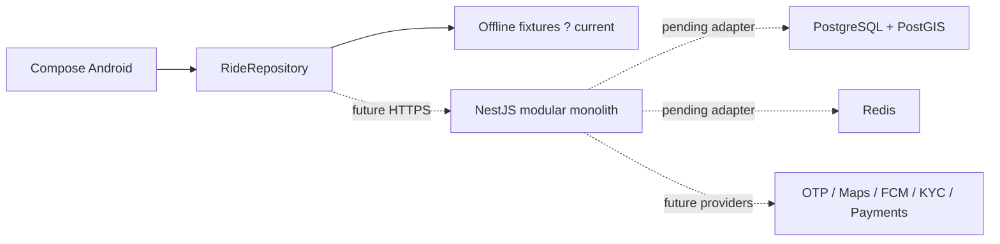

# Architecture
Android: Kotlin, Compose, lifecycle ViewModel and StateFlow, repository interfaces, unidirectional state. UI reads state and sends events; input validation and filtering remain in ViewModel/data layers. Package boundaries follow core and feature folders from the source. Feature README files are reserved boundaries, not completed implementations.

Foundation uses explicit offline fixtures injected through RideRepository. Android makes no network requests and collects no location. Future Hilt wiring, Retrofit, Room, DataStore and WorkManager enter when their adapters are implemented; unused dependencies are not added merely to suggest functionality.

Backend: Node.js/TypeScript/NestJS modular monolith. Domain modules include auth, user, vehicle, verification, ride, matching, booking, trip, payment, chat, notification, rating, safety and admin. Only health and fail-closed auth/ride scaffolds exist. Domain rules are independently testable. Global request IDs, input allowlisting and basic rate limiting are installed; authentication, authorization and distributed limits are pending.

Persistence: PostgreSQL 16 + PostGIS; Redis 7 for future realtime/cache. Private object storage and external Maps, OTP, FCM, KYC and payment adapters pending. Admin Next.js application is an explicit later-phase deliverable.

See adr/0001-foundation.md. No microservices or stack replacement.
