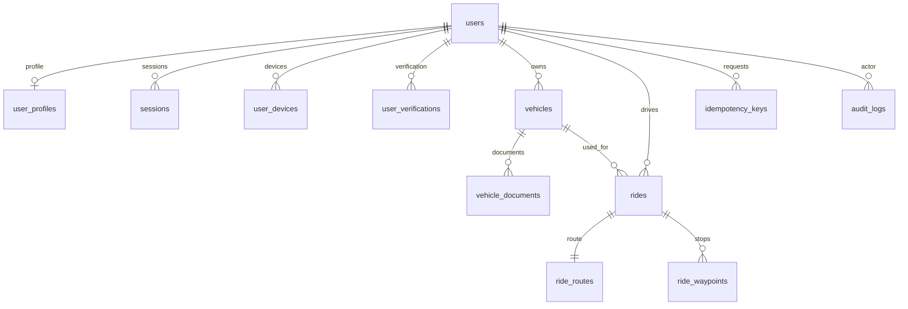

# Database schema
Migration: backend/migrations/001_foundation.sql. UUID identifiers; timezone-aware timestamps in UTC; minor-unit integer money; India currency INR; explicit ride/verification enum states; foreign keys enforce driver vehicle ownership. Documents store private object keys, never public URLs. Refresh tokens store hashes only. OTPs are provider-owned, no plaintext OTP persistence.

PostGIS geography(Point,4326) stores ride endpoints; geometry(LineString,4326) stores normalized driver routes. Both geometry and geography-cast GiST indexes support proximity candidate searches. Time/status indexes reduce candidates first. ST_LineLocatePoint checks pickup-before-drop. External route detour checks remain required.

Other tables: otp_challenges, matching_configuration, schema_migrations. Booking/trip/payment/refund/ledger/chat/rating/safety schemas are deferred to their reviewed phases to avoid inventing financial or privacy requirements.

Migration runner uses an advisory lock, verifies applied checksums and runs each migration in a transaction. Do not edit applied migrations. Down migrations are not provided; local test environments may be recreated explicitly. Publication still requires a transaction validating active user, verified unexpired driver/vehicle, capacity and provider-calculated route. The migration alone does not enforce all application rules.
